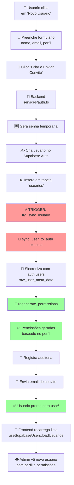
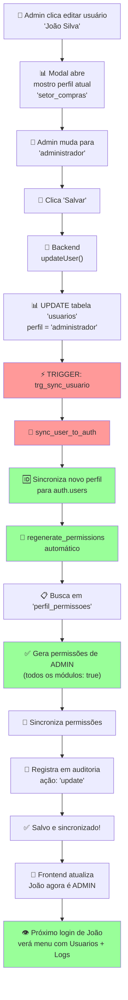
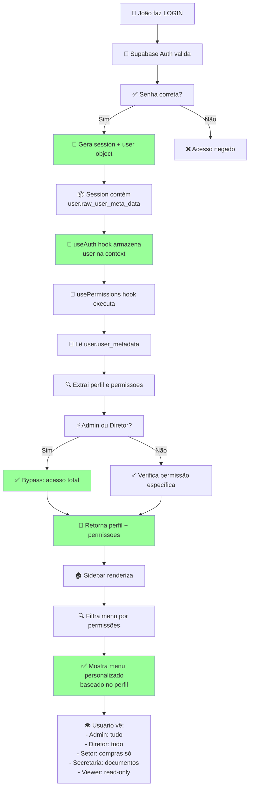

# 🔄 Fluxo de Sincronização Automática

## Diagrama: Criar Novo Usuário



---

## Diagrama: Editar Perfil de Usuário



---

## Diagrama: Fluxo de Login (After User Created)



---

## Fluxo de Sincronização Automática

```
┌──────────────────────────────────────────────────────────────┐
│ 1️⃣ INSERIR/ATUALIZAR em public.usuarios                       │
│    INSERT INTO usuarios (id, email, nome, perfil, ...)       │
│    UPDATE usuarios SET perfil = 'admin' WHERE id = '...'     │
└──────────┬───────────────────────────────────────────────────┘
           │
           ▼
┌──────────────────────────────────────────────────────────────┐
│ 2️⃣ TRIGGER: trg_sync_usuario (AFTER INSERT/UPDATE)           │
│    - Atualiza NEW.updated_at = now()                         │
│    - Executa: PERFORM sync_user_to_auth(NEW.id)             │
│    - Registra auditoria                                      │
└──────────┬───────────────────────────────────────────────────┘
           │
           ▼
┌──────────────────────────────────────────────────────────────┐
│ 3️⃣ FUNÇÃO: sync_user_to_auth(p_user_id)                      │
│    - SELECT * FROM usuarios WHERE id = p_user_id            │
│    - UPDATE auth.users SET raw_user_meta_data = {           │
│        nome, cargo, perfil, permissoes, status, is_admin     │
│      }                                                       │
└──────────┬───────────────────────────────────────────────────┘
           │
           ▼
┌──────────────────────────────────────────────────────────────┐
│ 4️⃣ RESULTADO NO AUTH.USERS                                   │
│    raw_user_meta_data agora contém:                         │
│    {                                                         │
│      "nome": "João Silva",                                   │
│      "perfil": "administrador",                              │
│      "permissoes": {...},                                    │
│      "status": "ativo",                                      │
│      "is_admin": true                                        │
│    }                                                         │
└──────────┬───────────────────────────────────────────────────┘
           │
           ▼
┌──────────────────────────────────────────────────────────────┐
│ 5️⃣ FRONTEND OBTÉM (on next login)                            │
│    - useAuth().user = session.user                          │
│    - user.user_metadata = raw_user_meta_data               │
│    - usePermissions() lê dados e retorna funções            │
│    - Sidebar filtra menu baseado em permissões              │
│    - ✅ Tudo automático!                                     │
└──────────────────────────────────────────────────────────────┘
```

---

## Regeneração Automática de Permissões

```
┌──────────────────────────────────┐
│ UPDATE usuarios SET              │
│   perfil = 'administrador'       │
│ WHERE id = '...'                 │
└──────────┬───────────────────────┘
           │
           ▼ (trigger executado)
┌──────────────────────────────────┐
│ regenerate_permissions(user_id)  │
└──────────┬───────────────────────┘
           │
           ▼
┌──────────────────────────────────┐
│ SELECT permissoes FROM           │
│   perfil_permissoes              │
│ WHERE perfil = 'administrador'   │
└──────────┬───────────────────────┘
           │
           ▼
┌──────────────────────────────────┐
│ UPDATE usuarios SET              │
│   permissoes = {todos: true}     │
│ WHERE id = '...'                 │
└──────────┬───────────────────────┘
           │
           ▼ (novo trigger!)
┌──────────────────────────────────┐
│ sync_user_to_auth() executa      │
│ Sincroniza nova permissões com   │
│ auth.users.raw_user_meta_data    │
└──────────────────────────────────┘
```

---

## Tabelas Envolvidas

```
auth.users (Supabase)
├─ id: UUID
├─ email: TEXT
├─ raw_user_meta_data: JSONB ◄─── Sincronizado por trigger
│  ├─ nome
│  ├─ cargo
│  ├─ perfil
│  ├─ permissoes
│  ├─ status
│  └─ is_admin
└─ (criado pelo Admin Auth)

                    ▲
                    │ sincronização
                    │ automática
                    │
public.usuarios (Database)
├─ id: UUID (FK → auth.users)
├─ email: TEXT
├─ nome: TEXT
├─ cargo: TEXT
├─ perfil: TEXT ◄─── mudança dispara regeneração
├─ permissoes: JSONB ◄─── regeneradas automaticamente
├─ status: TEXT
├─ is_admin: BOOLEAN (GENERATED)
├─ created_at, updated_at, last_login
└─ observacoes: TEXT

                    ▲
                    │ referência
                    │ para regen
                    │
public.perfil_permissoes (Reference)
├─ perfil: TEXT
├─ permissoes: JSONB
└─ descricao: TEXT

                    ▲
                    │ registra
                    │ tudo
                    │
public.usuarios_auditoria (Audit Log)
├─ usuario_id: UUID
├─ acao: TEXT (insert/update/sync_to_auth)
├─ dados_anterior: JSONB
├─ dados_novo: JSONB
├─ realizado_por: UUID
└─ created_at: TIMESTAMPTZ
```

---

## Timeline: Criar Usuário Admin

```
T=0ms   | 👤 Clique em "Novo Usuário"
T=100ms | 📝 Formulário aberto
T=500ms | 💾 Clique em "Criar"
T=550ms | 🔐 Backend começa
T=600ms | 🆔 Senha gerada
T=650ms | 🌐 Supabase Auth cria user
T=700ms | 📊 INSERT em public.usuarios
        | ⚡ TRIGGER disparado
        | 🔄 sync_user_to_auth() executa
        | 🆔 UPDATE auth.users
        | 🎯 regenerate_permissions() executa
        | 📋 SELECT de perfil_permissoes
        | ✅ UPDATE permissões
        | 📊 Auditoria registrada
T=800ms | 📧 Email enviado
T=900ms | ✅ Resposta ao frontend
T=950ms | 🎪 Lista atualizada
T=1000ms| 👁️ Admin vê novo usuário com perfil admin!

TEMPO TOTAL: ~1 segundo ✅
MANUAL NECESSÁRIO: ❌ NENHUM
AUTOMÁTICO: ✅ 100%
```

---

## Checklist de Sincronização

Quando você **criar** um usuário:
- ✅ Supabase Auth criado
- ✅ Inserido em `public.usuarios`
- ✅ Trigger acionado
- ✅ Sincronizado para `auth.users.raw_user_meta_data`
- ✅ Permissões regeneradas baseado no perfil
- ✅ Auditoria registrada
- ✅ Email enviado

Quando você **editar** um usuário:
- ✅ Atualizado em `public.usuarios`
- ✅ Trigger acionado
- ✅ Se mudou perfil: permissões regeneradas
- ✅ Sincronizado para `auth.users`
- ✅ Auditoria registrada

Quando usuário **faz login**:
- ✅ Session recuperada
- ✅ user_metadata lido
- ✅ Perfil extraído
- ✅ Permissões carregadas
- ✅ Menu filtrado

---

**Tudo automático. Zero configuração manual.** ✨
